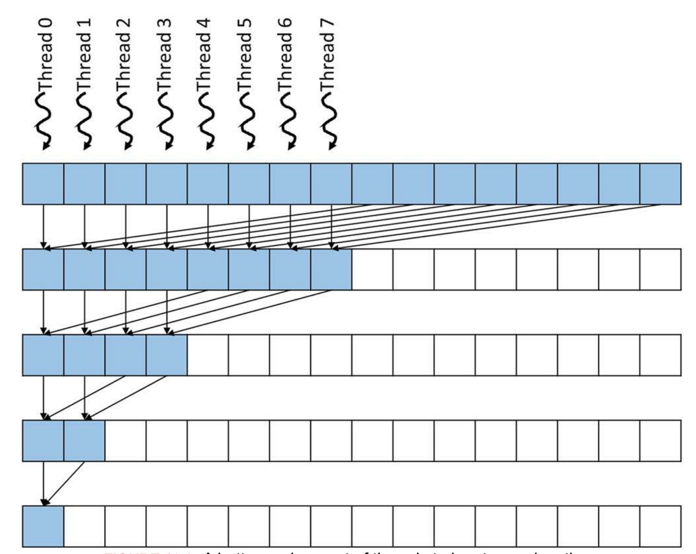
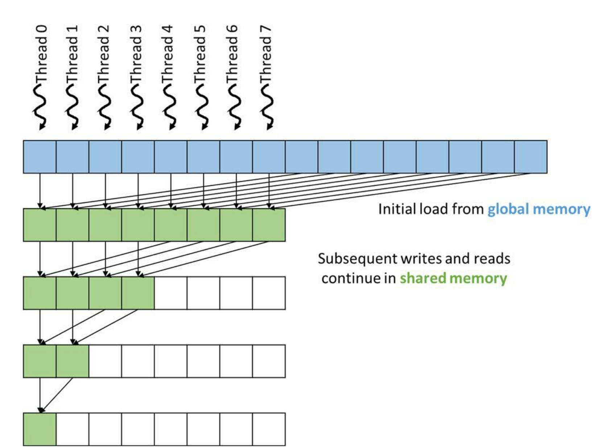
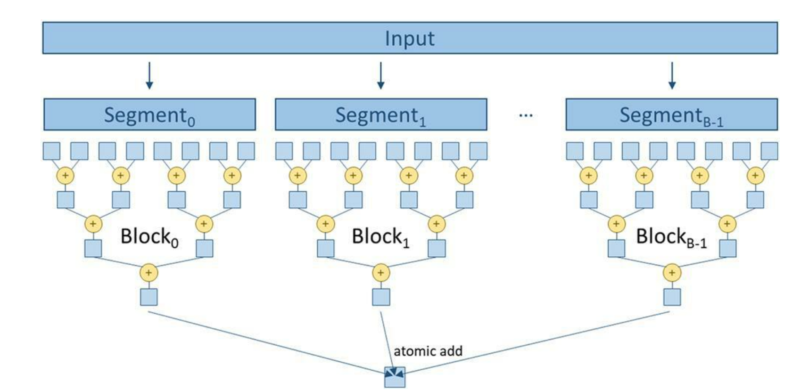
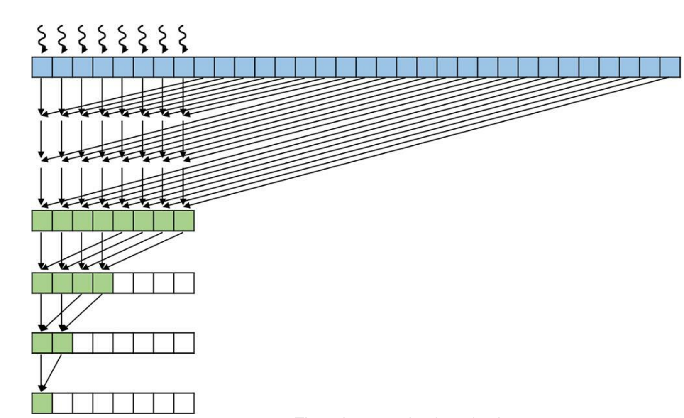
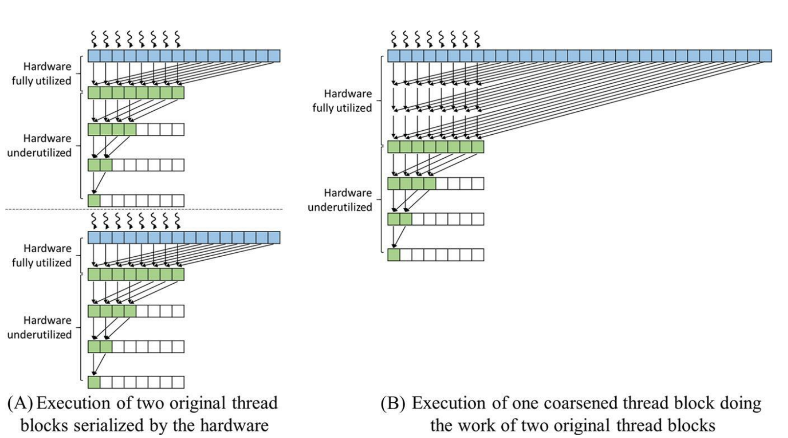

# CUDA kernels to perform parallel sum reduction tree

Below `simple_reduce_kernel` performs sum reduction tree within a single block. 

- For an input array of N elements main() call this kernel and launch a grid with one block of N/2 threads.
- A block can have up to 1024 threads, so this can process up to 2048 input elements. 
> See `segmented_shmem_sum_reduction` and later kernels for techniques that can reduce arbitrary input length

## Steps
- During step 1, all N/2 threads will participate; each thread adds two elements to produce N/2 partial sums. 
- During step 2, half of the threads will drop off, and only N/4 threads will continue to participate to produce N/4 partial sums. 
- This process will continue until the last time step, in which only one thread will remain and produce the total sum.


## Code version 1

```C++
constexpr int N = 2*1024;
__global__ void simple_reduce_kernel(float *d_out, float *d_in)
{
    unsigned int i = threadIdx.x*2;
    for (unsigned int k = 1; k <= blockDim.x; k *= 2) {
        if (threadIdx.x % k == 0) {
            d_in[i] += d_in[i+k];
        } 
        // wait for all adds at one stage are done
        __syncthreads();
    }

    if (i == 0) *d_out = d_in[0];
}

int main(int argc, char **argv)
{
    int IN_BYTES = sizeof(float) *  N;
    int OUT_BYTES = sizeof(float);

    float* h_in= new float[N];
    std::fill_n(h_in, N, 1);

    float *d_in;
    float *d_out;
    
    cudaMalloc((void **) &d_in, IN_BYTES);
    cudaMalloc((void **) &d_out, OUT_BYTES);

    cudaMemcpy(d_in, h_in, IN_BYTES, ::cudaMemcpyHostToDevice);

    double startTime = CycleTimer::currentSeconds();
    simple_reduce_kernel<<<1, N/2>>>(d_out, d_in);
    double endTime = CycleTimer::currentSeconds();    
    printf("Time elapsed %.3f ms \n", 1000.f * (endTime - startTime));

    float h_out;
    cudaMemcpy(&h_out, d_out, OUT_BYTES, ::cudaMemcpyDeviceToHost);

    printf("sum = %.3f \n", h_out);

    cudaFree(d_in);
    cudaFree(d_out);
    return 0;
}
```

## Minimizing control divergence 

The version 1 of kernel code has management of active and inactive threads in each iteration results in a high degree of control divergence. For example, as shown in abobe figrure, only those threads whose threadIdx.x values are even will execute the addition statement during the second iteration. Control divergence can significantly reduce the execution resource utilization efficiency, or the percentage of resources that are used in generating useful results. 

- In the first iteration, all 32 threads in a warp consume execution resources, but only half of them are active, wasting half of the execution resources. 
- During the second iteration, only one-fourth of the threads in a warp are active, wasting three-quarters of the execution resources. 
- During iteration 5, only one out of the 32 threads in a warp are active, wasting 31/32 of the execution resources. 

If the size of the input array is greater than 32, entire warps will become inactive after the fifth iteration. 
- E.g., for an input size of 256, 128 threads or four warps would be launched. 
- All four warps would have the same divergence pattern, as we explained in the previous paragraph for iterations 1 through 5. 
- During the sixth iteration, warp 1 and warp 3 would become completely inactive and thus exhibit no control divergence. 
- On the other hand, warp 0 and warp 2 would have only one active thread, exhibiting control divergence and wasting 31/32 of the execution resource. 
- During the seventh iteration, only warp 0 would be active, exhibiting control divergence and wasting 31/32 of the execution resource. 

The execution resource utilization efficiency for an input array of size N is the ratio between the total number of active threads to the total number of execution resources that are consumed. 


Total number of execution resources that are consumed is proportional to the total number of active warps across all iterations, since every active warp, no matter how few of its threads are active, consumes full execution resources. 

$$ (\frac{N}{64} * 5 + \frac{N}{64} * \frac{1}{2} + \frac{N}{64} * \frac{1}{4} + ... + 1) * 32  $$

Here:
$$ \frac{N}{2} threads * 32 \frac{threads}{wrap} = \frac{N}{64} wraps $$

Term:
$$ \frac{N}{64} $$ 
    is multiplied by 5 because all launched warps are active for five iterations. 
    
- After the fifth iteration the number of warps is reduced by half in each successive iteration. 
- The expression in parentheses gives the total number of active warps across all the iterations. 

The second term, `32`, reflects that each active warp consumes full execution resources for all 32 threads regardless of the number of active threads in these warps. 

For an input array size of 256, the consumed execution resource is (4*5+2+1)*32=736. 

The number of execution results `committed by the active threads` is the total number of active threads across all iterations:
$$ \frac{N}{64} * (32+16+8+4+2+1) + \frac{N}{64} * \frac{1}{2} *1 + \frac{N}{64} * \frac{1}{4}*1 + ... + 1 $$

- The terms in the parenthesis give the active threads in the first five iterations for all N/64 warps. 
- Starting at the sixth iteration, the number of active warps is reduced by half in each iteration, and there is only one active thread in each active warp. 

For an input array size of 256, the total number of committed results is $$4*(32+16+8+4+2+1)+2+1=255$$ 
- This result should be intuitive because the total number of operations that are needed to reduce 256 values is 255. 

Putting the previous two results together, we find that the execution resource utilization efficiency for an input array size of 256 is $$ 255/736=0.35 $$

This ratio states that the parallel execution resources did not achieve their full potential in speeding up this computation. On average, only about 35% of the resources consumed contributed to the sum reduction result. That is, we used only about 35% of the hardware’s potential to speed up the computation.

### A better assignment strategy 

To significantly reduces control divergence we should arrange the threads and their owned positions so that they can remain close to each other as time progresses.

We would like to have the stride value decrease, rather than increase, over time. The revised assignment strategy, shown below, is for an input array of 16 elements.
- Here, we assign the threads to the first half of the locations. 
- During the first iteration, each thread reaches halfway across the input array and adds an input element to its owner location. Thread 0 adds input[8] to its owned position input[0], thread 1 adds input[9] to its owned position input[1], and so on. 
- During each subsequent iteration, half of the active threads drop off, and all remaining active threads add an input element whose position is the number of active threads away from its owner position. In this example, during the third iteration there are two remaining active threads: Thread 0 adds input[2] into its owned position input[0], and thread 1 adds input[3] into its owned position input[1]. 




### Code version 2
```C++
__global__ void convergent_reduce_kernel(float *d_out, float *d_in)
{
    unsigned int i = threadIdx.x;
    for (unsigned int stride = blockDim.x; stride >= 1; stride /= 2) {
        if (threadIdx.x < stride) {
            d_in[i] += d_in[i + stride];
        } 
        // wait for all adds at one stage are done
        __syncthreads();
    }

    if (i == 0) *d_out = d_in[0];
}
```

## Minimizing memory divergence 

It is important to achieve memory coalescing within each warp. Adjacent threads in a warp should access adjacent locations when they access global memory. 

The `simple_reduce_kernel` also has performance issue: memory divergence.
- Adjacent threads do not access adjacent locations. In each iteration, each thread performs two global memory reads and one global memory write. 
- The first read is from its owned location, the second read is from the location that is of stride distance away from its owned location, and the write is to its owned location.
- Since the locations owned by adjacent thread are not adjacent locations, the accesses that are made by adjacent threads will not be fully coalesced. 
- During each iteration the memory locations that are collectively accessed by a warp are of stride distance away from each other.

Thus the total number of global memory requests is as follows:

$$ (\frac{N}{64} * 5 * 2 + \frac{N}{64} *1 + \frac{N}{64} * \frac{1}{2} + \frac{N}{64} * \frac{1}{4} + ... + 1) * 3 $$


The first term $$ \frac{N}{64} * 5 * 2 $$ corresponds to the first five iterations, in which all N/64 warps have two or more active threads, so each warp performs two global memory requests.

 The remaining terms account for the final iterations, in which each warp has only one active thread and performs one global memory request and half of the warps drop out in each subsequent iteration. The multiplication by 3 accounts for the two reads and one write by each active thread during each iteration. 
 
 In the 256-element example the total number of global memory requests performed by the kernel is `(4*5*2+4+2+1)*3=141`.

For the `convergent_reduce_kernel` the adjacent threads in each warp always access adjacent locations in the global memory, so the accesses are always coalesced. As a result, each warp triggers only one global memory request on any read or write. As the iterations progress, entire warps drop out, so no global memory access will be performed by any thread in these inactive warps. Half of the warps drop out in each iteration until there is only one warp for the final five iterations. Therefore the total number of global memory requests performed by the kernel is:

$$ ( (\frac{N}{64} + \frac{N}{64} * \frac{1}{2} + \frac{N}{64} * \frac{1}{4} + ... + 1) + 5) * 3 $$

For the 256-element example the total number of global memory requests performed is `((4+2+1)+5)*3=36`. 

The improved kernel results in `141/36=3.9×` fewer global memory requests. 

For a 2048-element example the total number of global memory requests that are performed by `simple_reduce_kernel` is `(32*5*2+32+16+8+4+2+1)*3=1149`, whereas
the number of global memory requests that are performed by `convergent_reduce_kernel` is `(32+16+8+4+2+1+5)*3=204`. 

- The ratio is 5.6, even more than in the 256-element example.
- This is because of the inefficient execution pattern of the simple_reduce_kernel, in which there are more active warps during the initial five iterations of the execution and each active warp triggers twice the number of global memory requests as the convergent kernel.


## Minimizing global memory accesses 

The `convergent_reduce_kernel` can be further improved by using shared memory.

- In each iteration, threads write their partial sum result values out to the global memory, and these values are reread by the same threads and other threads in the next iteration. 
- Since the shared memory has much shorter latency and higher bandwidth than the global memory, we can further improve the execution speed by keeping the partial sum results in the shared memory. 



### shmem_convergent_reduce_kernel

```C++
__global__ void shmem_convergent_reduce_kernel(float *d_out, float *d_in)
{
    __shared__ float shared_in[BLOCK_DIM];

    unsigned int i = threadIdx.x;
    shared_in[i] = d_in[i] + d_in[i + BLOCK_DIM];

    for (unsigned int stride = blockDim.x/2; stride >= 1; stride /= 2) {
        __syncthreads();

        if (threadIdx.x < stride) {
            shared_in[i] += shared_in[i + stride];
        } 
    }

    if (i == 0) *d_out = shared_in[0];
}
```

Using the `shmem_convergent_reduce_kernel`, the number of global memory accesses are reduced to the initial loading of the original contents of the input array and the final write to input[0]. 
- Thus for an N-element reduction the number of global memory accesses is just N+1. 
- Note also that both global memory reads are coalesced. 
- So with coalescing, there will be only (N/32)+1 global memory requests. 

For the 256-element example the total number of global memory requests that are triggered will be reduced from 36 for `convergent_reduce_kernel` to 8+1=9 for the shared memory kernel, a 4× improvement. 

Besides reducing the number of global memory accesses, the input array is not modified.

## Hierarchical reduction for arbitrary input length

The `__syncthreads()` is used as a barrier synchronization among all the active threads. 
- __syncthreads() can be used only among threads in the same block. 
- This limits the level of parallelism to 1024 threads on current hardware. 

For large input arrays that contain millions or even billions of elements, we can benefit from launching more threads to further accelerate the reduction process. 
- Since we do not have a good way to perform barrier synchronization among threads in different blocks, we will need to allow threads in different blocks to execute independently. 

The idea is to partition the input array into segments so that each segment is of appropriate size for a block. All blocks then independently execute a reduction tree and accumulate their results to the final output using an atomic add operation.




### segmented_shmem_sum_reduction

```C++

__global__ void segmented_shmem_sum_reduction(float *d_out, float *d_in)
{
    extern __shared__ float sdata[];
    
    unsigned int segment = 2*blockDim.x*blockIdx.x;        
    unsigned int i = segment + threadIdx.x;
    unsigned int t = threadIdx.x;

    sdata[t] = d_in[i] + d_in[i + BLOCK_DIM];

    for (unsigned int stride = blockDim.x/2; stride >= 1; stride /= 2) {
        __syncthreads();

        if (t < stride) {
            sdata[t] += sdata[t + stride];
        } 
    }

    if (threadIdx.x == 0) {
        atomicAdd(d_out, sdata[0]);
    }
}
```

## Thread coarsening for reduced overhead 

segmented_shmem_sum_reduction try to maximize parallelism by using as many threads as possible. 
- For a reduction of N elements, N/2 threads are launched. 
- With a thread block size of 1024 threads, the resulting number of thread blocks is N/2048. 

In processors with limited execution resources the hardware may have only enough resources to execute a portion of the thread blocks in parallel. 
- In this case, the hardware will serialize the surplus thread blocks, executing a new thread block whenever an old one has completed. 
- To parallelize reduction, we have actually paid a heavy price to distribute the work across multiple thread blocks. 

Hardware underutilization increases with each successive stage of the reduction tree because of more warps becoming idle and the final warp experiencing more control divergence.The phase in which the hardware is underutilized occurs for every thread block that we launch. It is an inevitable price to pay if the thread blocks are to actually run in parallel. 

- However, if the hardware is to serialize these thread blocks, we are better off serializing them ourselves in a more efficient manner. 
- Thread coarsening is a category of optimizations that serialize some of the work into fewer threads to reduce parallelization overhead. 



### coarsened_shmem_sum_reduction

```C++
__global__ void coarsened_shmem_sum_reduction(float *d_out, float *d_in, unsigned int coarse_factor)
{
    extern __shared__ float sdata[];
    
    unsigned int segment = coarse_factor * 2*blockDim.x*blockIdx.x;
    unsigned int i = segment + threadIdx.x;
    unsigned int t = threadIdx.x;

    float sum = d_in[i];
    for (unsigned int tile = 1; tile < coarse_factor * 2; ++tile) {
        sum += d_in[i + tile * BLOCK_DIM];
    }
    sdata[t] = sum;

    for (unsigned int stride = blockDim.x/2; stride >= 1; stride /= 2) {
        __syncthreads();

        if (t < stride) {
            sdata[t] += sdata[t + stride];
        } 
    }

    if (threadIdx.x == 0) {
        atomicAdd(d_out, sdata[0]);
    }
}
```

In `segmented_shmem_sum_reduction`, each thread block received 16 elements, which is two elements per thread. 
- Each thread independently adds the two elements for which it is responsible; 
- then the threads collaborate to execute a reduction tree. 

In `coarsened_shmem_sum_reduction` we coarsen the thread block by a factor of 2. 
- Hence each thread block receives twice the number of elements, 32 elements, which is four elements per thread. 
- In this case, each thread independently adds four elements before the threads collaborate to execute a reduction tree. 

The three steps to add the four elements are illustrated by the first three rows in figure f5.png. 
- Note that all threads are active during these three steps. 
- Moreover, since the threads independently add the four elements for which they are responsible, they do not need to synchronize
- They do not need to store their partial sums to shared memory until after all four elements have been added. 

The remaining steps in performing the reduction tree are the same as those in `segmented_shmem_sum_reduction`


Compares the execution of two original thread blocks without coarsening serialized by the hardware, with one coarsened thread block performing the work of two thread blocks




The first thread block performs one step in which each thread adds the two elements for which it is responsible. All threads are active during this step, so the hardware is fully utilized. The remaining three steps execute the reduction tree in which half the threads drop out each step, underutilizing the hardware. Moreover, each step requires a barrier synchronization as well as accesses to shared memory.

When the first thread block is done, the hardware then schedules the second thread block, which follows the same steps but on a different segment of the data. Overall, the two blocks collectively take a total of eight steps, of which two steps fully utilize the hardware and six steps underutilize the hardware and require barrier synchronization and shared memory access.


By contrast,see the same amount of data is processed by only a single thread block that is coarsened by a factor of 2. 

This thread block initially takes three steps in which each thread adds the four elements for which it is responsible. 

All threads are active during all three steps, so the hardware is fully utilized, and no barrier synchronizations or accesses to shared memory are performed. 

The remaining three steps execute the reduction tree in which half the threads drop out each step, underutilizing the hardware, and barrier synchronization and accesses to shared memory are needed. 

Overall, only six steps are needed (instead of eight), of which three steps (instead of two) fully utilize the hardware and three steps (instead of six) underutilize the hardware and require barrier synchronization and shared memory access. Therefore thread coarsening effectively reduces the overhead from hardware underutilization, synchronization, and access to shared memory.


## References
Hwu, Wen-mei W.; Kirk, David B.; Hajj, Izzat El. Programming Massively Parallel Processors. Elsevier Science. Kindle Edition. 
