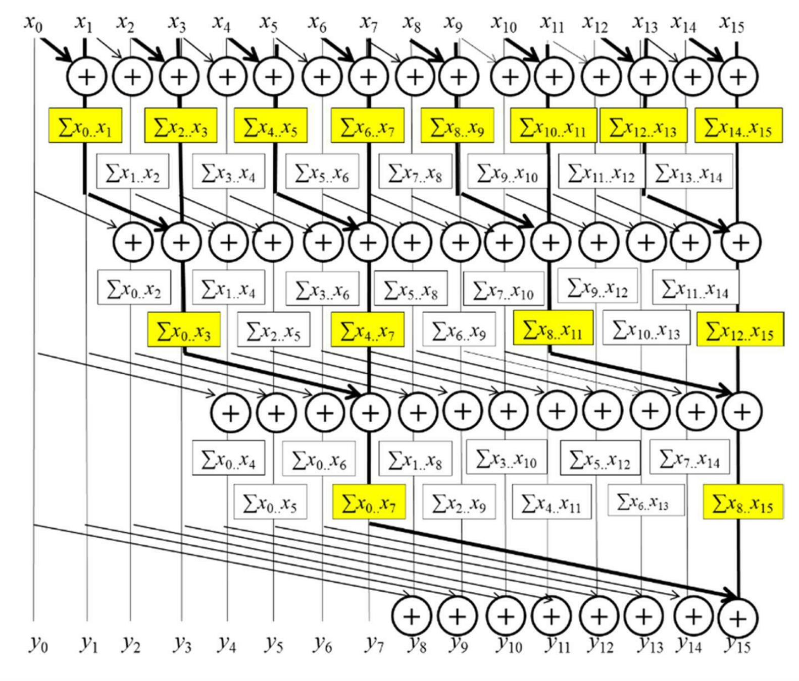

# CUDA kernels for parallel scan (aka prefix sum)

Parallel scan is frequently used to parallelize seemingly sequential operations, such as resource allocation, work assignment, and polynomial evaluation. 

In general, if a computation is naturally described as a mathematical recursion in which each item in a series is defined in terms of the previous item, it can likely be parallelized as a parallel scan operation. 

Parallel scan plays a key role in massively parallel computing for a simple reason: Any sequential section of an application can drastically limit the overall performance of the application. Many such sequential sections can be converted into parallel computation with parallel scan. For this reason, parallel scan is often used as a primitive operation in parallel algorithms that perform radix sort, quick sort, string comparison, polynomial evaluation, solving recurrences, tree operations, and stream compaction. 

Another reason why parallel scan is an important parallel pattern is that it is a typical example of where the work performed by some parallel algorithms can have higher complexity than the work performed by a sequential algorithm, leading to a tradeoff that needs to be carefully made between algorithm complexity and parallelization. 

Inclusive scan operation takes a binary associative operator $\Theta$ and an input array of n elements $[x_0, x_1, …, x_{n−1}]$, and returns the following output array:

$$ [x_0,  (x_0 \Theta x_1), ..., (x_0 \Theta x_1 \Theta ... \Theta x_{n-1})]  $$

An exclusive scan operation is similar to an inclusive scan operation with a slightly different arrangement of the output array:

$$ [I, x_0,  (x_0 \Theta x_1), ..., (x_0 \Theta x_1 \Theta ... \Theta x_{n-2})]  $$


## Parallel scan with the Kogge-Stone algorithm

Since the reduction tree for element i involves i add operations, naive approach would still increase the computational complexity to $O(N^2)$ unless we find a way to share the partial sums across the reduction trees of different output elements. 

A sharing approach, is the Kogge-Stone algorithm. 



### simple_scan_kernel
```C++
__global__ void double_buffers_inclusive_scan_kernel(float *Y, float *X)
{    
    extern __shared__ float XY[];

    int n = blockDim.x;

    unsigned int t = threadIdx.x;
    unsigned int i = blockIdx.x * n + t;

    XY[t] = X[i];
    __syncthreads();

    int pout = 0;
    int pin = 1-pout;

    for (unsigned int stride = 1; stride < n; stride *= 2) {
        pin = 1 - pin;
        pout = 1 - pin;
        if (t >= stride) {
            XY[pout*n + t] = XY[pin*n + t] + XY[pin*n + t - stride];
        }
        else  {  
            XY[pout*n + t] = XY[pin*n + t];
        }
        
        __syncthreads(); // TODO why we need a sync barrier?
    }

    Y[i] = XY[pout * n + t];
}
```

The algorithm, illustrated above , is an in-place scan algorithm that operates on an array XY that originally contains input elements. 
- It iteratively evolves the contents of the array into output elements. 
- Before the algorithm begins, we assume that XY[i] contains input element X[i]. 
- After k iterations, XY[i] will contain the sum of up to $2^k$ input elements at and before the location $i$. 

After one step, XY[i] will contain $x_{i−1}+x_i$ and after iteration 2, XY[i] will contain $x_{i−3} + x_{i−2} + x_{i−1} + x_i$, and so on.

There is a very important difference compared to reduction in updating of the XY elements in each iteration of the for-loop. 

- Each active thread first stores the partial sum for its position into a temp variable (in a register). 
- After all threads have completed a second barrier synchronization, all of them store their partial sum values to their XY positions. 
- The need for the extra `temp` and `__syncthreads()` has to do with a write-after-read data dependence hazard in these updates. 

Each active thread adds the XY value at its own position (XY[threadIdx.x]) and that at a position of another thread (XY[threadIdx.x-stride]). 
- If a thread $i$ writes to its output position before another thread $i+stride$ has had the chance to read the old value at that position, the new value can corrupt the addition performed by the other thread. 
- The race condition is overcome with the temporary variable and the __syncthreads( ) barrier. All active threads first perform addition and write into their private temp variables. Therefore none of the old values in XY locations will be overwritten. The barrier __syncthread( ) ensures that all active threads have completed their read of the old XY values before any of them can move forward and perform a write. Thus it is safe for after-barrier statement to overwrite the XY locations.

The reason why an updated XY position may be used by another active thread is that the Kogge-Stone approach reuses the partial sums across reduction trees to reduce the computational complexity. 

In constrast, There is no race condition caused by a write-after-read hazard in reduction kernels because the elements written to by the active threads in an iteration are not read by any of the other active threads during the same iteration.
- In reduction kernels, each active thread takes its inputs from its own position (input[threadIdx.x]) and a position that is of stride distance to the right (input[threadIdx.x+stride]). 
- None of the stride distance positions are updated by any active threads during any given iteration. 
- All active threads will always be able to read the old value of their respective input[threadIdx.x]. 
- Since the execution within a thread is always sequential, each thread will always be able to read the old value in input[threadIdx.x] before writing the new value into the position. 

To avoid having a second barrier synchronization on every iteration, we can use separate arrays for input and output. If separate arrays are used, the location that is being written to is different from the location that is being read from, so there is no longer any potential write-after-read race condition. 
- This approach would require having two shared memory buffers instead of one. 
- First, we load from the global memory to the first buffer. 
- In the first iteration we read from the first buffer and write to the second buffer. 
- In the second iteration we read from the second buffer and write to the first buffer. 
- Following the same reasoning, in the third iteration we read from the first buffer and write to the second buffer. 
- Continue alternating input/output buffers until the iterations complete. 

This optimization is called double-buffering. Double-buffering is commonly used in parallel programming as a way to overcome write-after-read race conditions

### exclusive scan kernel

Exclusive scan is equivalent to an inclusive scan with all elements shifted to the right by one position and element 0 filled with the identity value. 

```C++
__global__ void double_buffers_exclusive_scan(float *Y, float *X)
{
    extern __shared__ float XY[];

    int n = blockDim.x;
    unsigned int t = threadIdx.x;
    unsigned int i = blockIdx.x * n + t;

    XY[t] = ((t == 0) ? 0.0f : X[i-1]);
    __syncthreads();

    int pout = 0;
    int pin = 1-pout;
    for (unsigned int stride = 1; stride < n; stride *= 2) {
        pin = 1 - pin;
        pout = 1 - pin;
        if (t >= stride) {
            XY[pout*n + t] = XY[pin*n + t] + XY[pin*n + t - stride];
        }
        else  {  
            XY[pout*n + t] = XY[pin*n + t];
        }
        
        __syncthreads(); // TODO works with no sync barrier?
    }

    Y[i] = XY[pout * n + t];
}
```

## References
- Programming Massively Parallel Processors - A Hands-on Approach, David B. Kirk, Wen-mei W. Hwu, First Edition, Morgan Kaufmann, Elsevier, 2010
