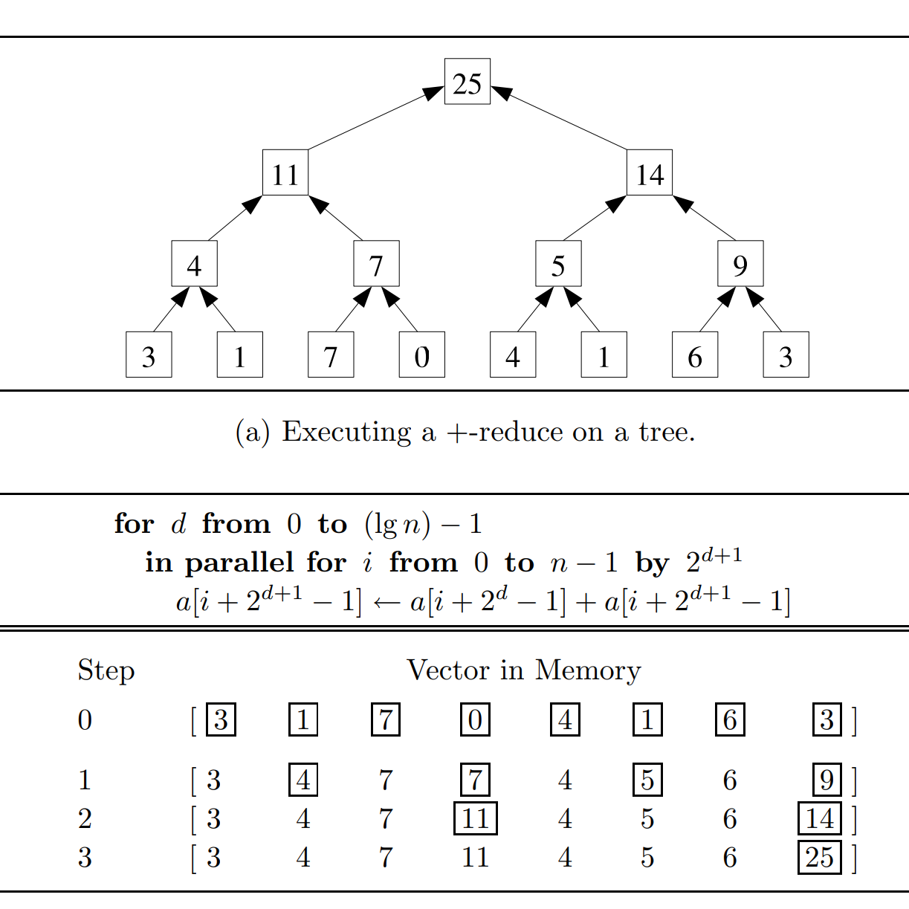
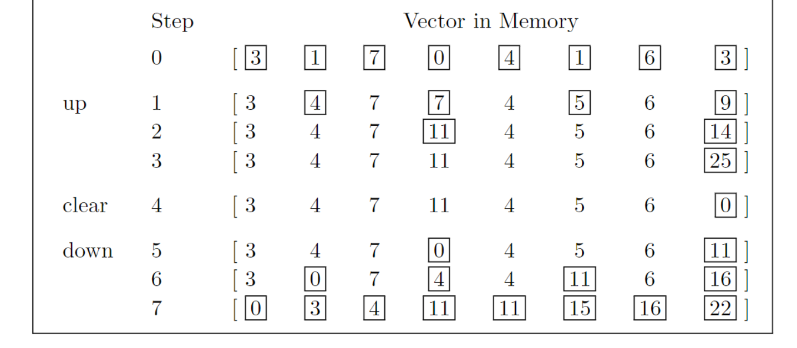
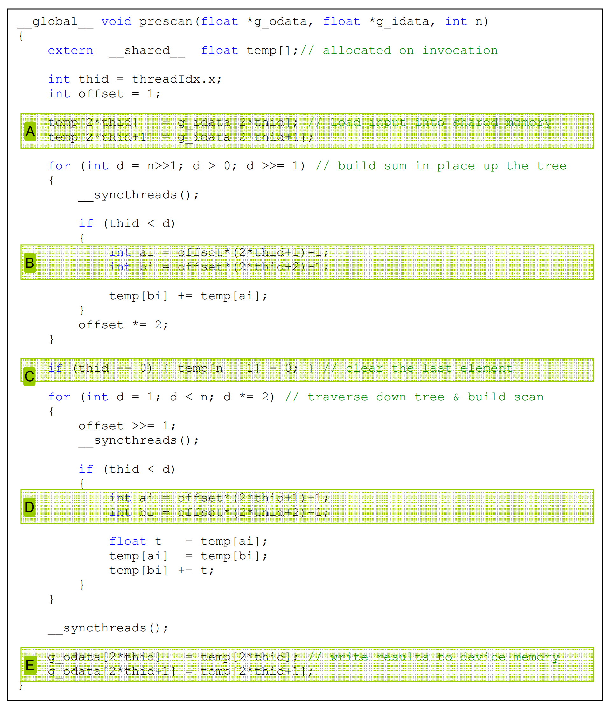

# CUDA kernels for parallel scan (aka prefix sum)

Parallel scan is frequently used to parallelize seemingly sequential operations, such as resource allocation, work assignment, and polynomial evaluation. 

In general, if a computation is naturally described as a mathematical recursion in which each item in a series is defined in terms of the previous item, it can likely be parallelized as a parallel scan operation. 

Parallel scan plays a key role in massively parallel computing for a simple reason: Any sequential section of an application can drastically limit the overall performance of the application. Many such sequential sections can be converted into parallel computation with parallel scan. For this reason, parallel scan is often used as a primitive operation in parallel algorithms that perform radix sort, quick sort, string comparison, polynomial evaluation, solving recurrences, tree operations, and stream compaction. 

Another reason why parallel scan is an important parallel pattern is that it is a typical example of where the work performed by some parallel algorithms can have higher complexity than the work performed by a sequential algorithm, leading to a tradeoff that needs to be carefully made between algorithm complexity and parallelization. 

Inclusive scan operation takes a binary associative operator $\Theta$ and an input array of n elements $[x_0, x_1, …, x_{n−1}]$, and returns the following output array:

$$ [x_0,  (x_0 \Theta x_1), ..., (x_0 \Theta x_1 \Theta ... \Theta x_{n-1})]  $$

An exclusive scan operation is similar to an inclusive scan operation with a slightly different arrangement of the output array:

$$ [I, x_0,  (x_0 \Theta x_1), ..., (x_0 \Theta x_1 \Theta ... \Theta x_{n-2})]  $$


## Parallel scan with the Kogge-Stone algorithm

Since the reduction tree for element i involves i add operations, naive approach would still increase the computational complexity to $O(N^2)$ unless we find a way to share the partial sums across the reduction trees of different output elements. 

A sharing approach, is the Kogge-Stone algorithm. 


### simple_scan_kernel
```C++
__global__ void double_buffers_inclusive_scan_kernel(float *Y, float *X)
{    
    extern __shared__ float XY[];

    int n = blockDim.x;

    unsigned int t = threadIdx.x;
    unsigned int i = blockIdx.x * n + t;

    XY[t] = X[i];
    __syncthreads();

    int pout = 0;
    int pin = 1-pout;

    for (unsigned int stride = 1; stride < n; stride *= 2) {
        pin = 1 - pin;
        pout = 1 - pin;
        if (t >= stride) {
            XY[pout*n + t] = XY[pin*n + t] + XY[pin*n + t - stride];
        }
        else  {  
            XY[pout*n + t] = XY[pin*n + t];
        }
        
        __syncthreads(); 
    }

    Y[i] = XY[pout * n + t];
}
```

The algorithm, illustrated above , is an in-place scan algorithm that operates on an array XY that originally contains input elements. 
- It iteratively evolves the contents of the array into output elements. 
- Before the algorithm begins, we assume that XY[i] contains input element X[i]. 
- After k iterations, XY[i] will contain the sum of up to $2^k$ input elements at and before the location $i$. 

After one step, XY[i] will contain $x_{i−1}+x_i$ and after iteration 2, XY[i] will contain $x_{i−3} + x_{i−2} + x_{i−1} + x_i$, and so on.

There is a very important difference compared to reduction in updating of the XY elements in each iteration of the for-loop. 

- Each active thread first stores the partial sum for its position into a temp variable (in a register). 
- After all threads have completed a second barrier synchronization, all of them store their partial sum values to their XY positions. 
- The need for the extra `temp` and `__syncthreads()` has to do with a write-after-read data dependence hazard in these updates. 

Each active thread adds the XY value at its own position (XY[threadIdx.x]) and that at a position of another thread (XY[threadIdx.x-stride]). 
- If a thread $i$ writes to its output position before another thread $i+stride$ has had the chance to read the old value at that position, the new value can corrupt the addition performed by the other thread. 
- The race condition is overcome with the temporary variable and the __syncthreads( ) barrier. All active threads first perform addition and write into their private temp variables. Therefore none of the old values in XY locations will be overwritten. The barrier __syncthread( ) ensures that all active threads have completed their read of the old XY values before any of them can move forward and perform a write. Thus it is safe for after-barrier statement to overwrite the XY locations.

The reason why an updated XY position may be used by another active thread is that the Kogge-Stone approach reuses the partial sums across reduction trees to reduce the computational complexity. 

In constrast, There is no race condition caused by a write-after-read hazard in reduction kernels because the elements written to by the active threads in an iteration are not read by any of the other active threads during the same iteration.
- In reduction kernels, each active thread takes its inputs from its own position (input[threadIdx.x]) and a position that is of stride distance to the right (input[threadIdx.x+stride]). 
- None of the stride distance positions are updated by any active threads during any given iteration. 
- All active threads will always be able to read the old value of their respective input[threadIdx.x]. 
- Since the execution within a thread is always sequential, each thread will always be able to read the old value in input[threadIdx.x] before writing the new value into the position. 

To avoid having a second barrier synchronization on every iteration, we can use separate arrays for input and output. If separate arrays are used, the location that is being written to is different from the location that is being read from, so there is no longer any potential write-after-read race condition. 
- This approach would require having two shared memory buffers instead of one. 
- First, we load from the global memory to the first buffer. 
- In the first iteration we read from the first buffer and write to the second buffer. 
- In the second iteration we read from the second buffer and write to the first buffer. 
- Following the same reasoning, in the third iteration we read from the first buffer and write to the second buffer. 
- Continue alternating input/output buffers until the iterations complete. 

This optimization is called double-buffering. Double-buffering is commonly used in parallel programming as a way to overcome write-after-read race conditions

### exclusive scan kernel

Exclusive scan is equivalent to an inclusive scan with all elements shifted to the right by one position and element 0 filled with the identity value. 

```C++
__global__ void double_buffers_exclusive_scan(float *Y, float *X)
{
    extern __shared__ float XY[];

    int n = blockDim.x;
    unsigned int t = threadIdx.x;
    unsigned int i = blockIdx.x * n + t;

    XY[t] = ((t == 0) ? 0.0f : X[i-1]);
    __syncthreads();

    int pout = 0;
    int pin = 1-pout;
    for (unsigned int stride = 1; stride < n; stride *= 2) {
        pin = 1 - pin;
        pout = 1 - pin;
        if (t >= stride) {
            XY[pout*n + t] = XY[pin*n + t] + XY[pin*n + t - stride];
        }
        else  {  
            XY[pout*n + t] = XY[pin*n + t];
        }
        
        __syncthreads(); 
    }

    Y[i] = XY[pout * n + t];
}
```

## The Brent-Kung algorithm 

Kogge-Stone kernel is conceptually simple but its work efficiency is quite low for some practical applications. 
- There are potential opportunities for further sharing of some intermediate results. 
- However, to allow more sharing across multiple threads, we need to strategically calculate the intermediate results and distribute them to different threads, which may require additional computation steps.

The fastest parallel way to produce sum values for a set of values is a reduction tree. 
- With sufficient execution units, a reduction tree can generate the sum for N values in log2(N) time units. 
- The tree can also generate several sub-sums that can be used in the calculation of some of the scan output values. 


The Brent-Kung adder design can be used to implement a parallel scan algorithm with better work efficiency. 

Fig. H2 illustrates the steps for a parallel inclusive scan algorithm based on the Brent-Kung adder design. 



In the top half of above figure, we produce the sum of all 16 elements in four steps.

- We use the minimal number of operations needed to generate the sum. 
- During the first step, only the odd element of XY[i] will be updated to XY[i-1]+XY[i]. 
- During the second step, only the XY elements whose indices are of the form of 4*n−1, which are 3, 7, 11, and 15 in Fig. 11.5, will be updated. 
- During the third step, only the XY elements whose indices are of the form 8*n−1, which are 7 and 15, will be updated. 
- During the fourth step, only XY[15] is updated. 

The total number of operations performed is 8+4+2+1=15. In general, for a scan section of N elements, we would do (N/2)+(N/4)+…+2+1=N−1 operations for this reduction phase.

We could implement the reduction tree phase of the parallel scan using the following loop:



The loop is similar to the reduction in parallel recude code. There are two differences. 

- First difference is that we accumulate the sum value toward the highest position, which is XY[blockDim.x-1], rather than XY[0]. This is because the final result of the highest position is the total sum. For this reason, each active thread reaches for a partial sum to its left by subtracting the stride value from its index. 

- The second difference is that we want the active threads to have a thread index of the form 2n−1 rather than 2n. This is why we add 1 to the threadIdx.x before the modulo (%) operation when we select the threads for performing addition in each iteration.

One drawback of this style of reduction is that it has significant control divergence problems. A better way is to use a decreasing number of contiguous threads to perform the additions as the loop advances. Unfortunately, the technique we used to reduce divergence cannot be used in the scan reduction tree phase, since it does not generate the needed partial sum values in the intermediate XY positions. 

We resort to a more sophisticated thread index to data index mapping that maps a continuous section of threads to a series of data positions that are of stride distance apart. The following code does so by mapping a continuous section of threads to the XY positions whose indices are of the form k*2n−1:


The second part of the algorithm is to use a reverse tree to distribute the partial sums to the positions that can use them to complete the result of those positions. 

The distribution of partial sums is illustrated in the bottom half of Fig. H2. To understand the design of the reverse tree, we should first analyze the needs for additional values to complete the scan output at each position of XY. It should be apparent from an inspection of H2 that the additions in the reduction tree always accumulate input elements in a continuous range. Therefore we know that the values that have been accumulated into each position of XY can always be expressed as a range of input elements xi…xj, where xi is the starting position and xj is the ending position (inclusive).



H3 shows the state of each position (column), including both the values already accumulated into the position and the need for additional input element values at each level (row) of the reverse tree. 

The state of each position initially and after each level of additions in the reverse tree is expressed as the input elements, in the form xi…xj, that have already been accounted for in the position. For example, x8…x11 in row Initial and column 11 indicates that the values of x8, x9, x10, and x11 have been accumulated into XY[11] before the reverse tree begins. At the end of the reduction tree phase, we have quite a few positions that are complete with the final scan values. In our example, XY[0], XY[1], XY[3], XY[7], and XY[15] are all complete with their final answers.

To organize our second half of the addition operations, we will first show all the operations that need partial sums from four positions away, then two positions away, then one position away. 

- During the first level of the reverse tree, we add XY[7] to XY[11], which brings XY[11] to the final answer. 

- During the second level, we complete XY[5], XY[9], and XY[13], which can be completed with the partial sums that are two positions away: XY[3], XY[7], and XY[11], respectively. 

- Finally, during the third level, we complete all even positions XY[2], XY[4], XY[6], XY[8], XY[10], and XY[12] by accumulating the partial sums that are one position away (immediate left neighbor of each position).

To implement the reverse tree we let the stride value decreases from SECTION_SIZE/4 to 1. In each iteration we need to “push” the value of XY elements from positions that are multiples of twice the stride value minus 1 to the right by stride positions.


## References
Hwu, Wen-mei W.; Kirk, David B.; Hajj, Izzat El. Programming Massively Parallel Processors. Elsevier Science. Kindle Edition. 
