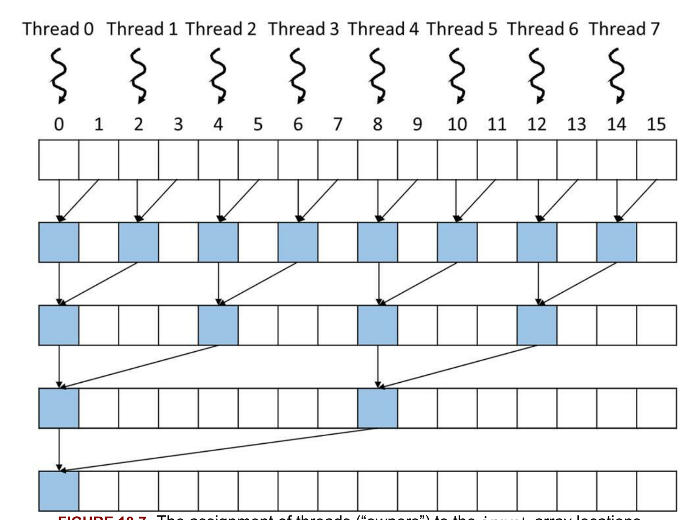

# Simple CUDA kernel to perform parallel sum reduction tree.

This kernel performs sum reduction tree within a single block. 

- For an input array of N elements main() call this kernel and launch a grid with one block of N/2 threads.
- A block can have up to 1024 threads, so this can process up to 2048 input elements. 
> See reduction.cu for code that solves 2048-elements array limitation.

## Steps
- During step 1, all N/2 threads will participate; each thread adds two elements to produce N/2 partial sums. 
- During step 2, half of the threads will drop off, and only N/4 threads will continue to participate to produce N/4 partial sums. 
- This process will continue until the last time step, in which only one thread will remain and produce the total sum.



## Code 

```C++
constexpr int N = 2*1024;
__global__ void simple_reduce_kernel(float *d_out, float *d_in)
{
    unsigned int i = threadIdx.x*2;
    for (unsigned int k = 1; k <= blockDim.x; k *= 2) {
        if (threadIdx.x % k == 0) {
            d_in[i] += d_in[i+k];
        } 
        // wait for all adds at one stage are done
        __syncthreads();
    }

    if (i == 0) *d_out = d_in[0];
}

int main(int argc, char **argv)
{
    int IN_BYTES = sizeof(float) *  N;
    int OUT_BYTES = sizeof(float);

    float* h_in= new float[N];
    std::fill_n(h_in, N, 1);

    float *d_in;
    float *d_out;
    
    cudaMalloc((void **) &d_in, IN_BYTES);
    cudaMalloc((void **) &d_out, OUT_BYTES);

    cudaMemcpy(d_in, h_in, IN_BYTES, ::cudaMemcpyHostToDevice);

    double startTime = CycleTimer::currentSeconds();
    simple_reduce_kernel<<<1, N/2>>>(d_out, d_in);
    double endTime = CycleTimer::currentSeconds();    
    printf("Time elapsed %.3f ms \n", 1000.f * (endTime - startTime));

    float h_out;
    cudaMemcpy(&h_out, d_out, OUT_BYTES, ::cudaMemcpyDeviceToHost);

    printf("sum = %.3f \n", h_out);

    cudaFree(d_in);
    cudaFree(d_out);
    return 0;
}
```

## References
- Programming Massively Parallel Processors - A Hands-on Approach, David B. Kirk, Wen-mei W. Hwu, First Edition, Morgan Kaufmann, Elsevier, 2010
