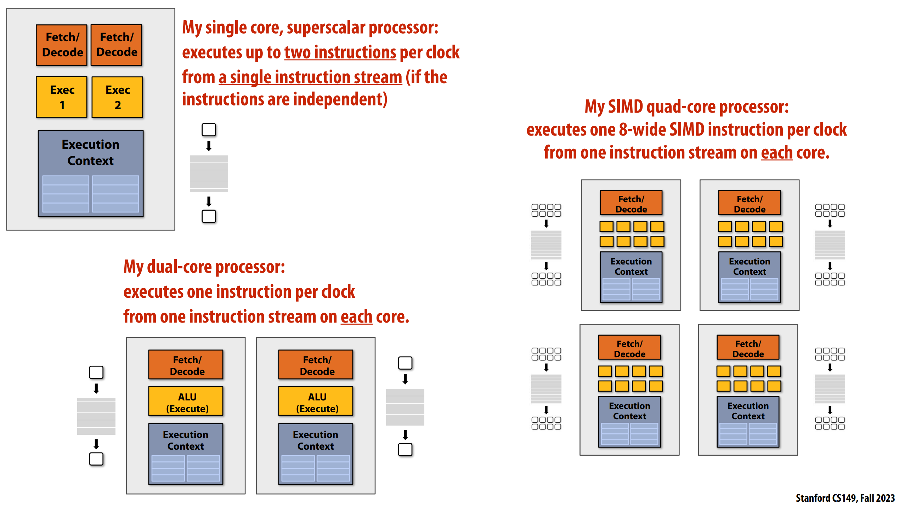
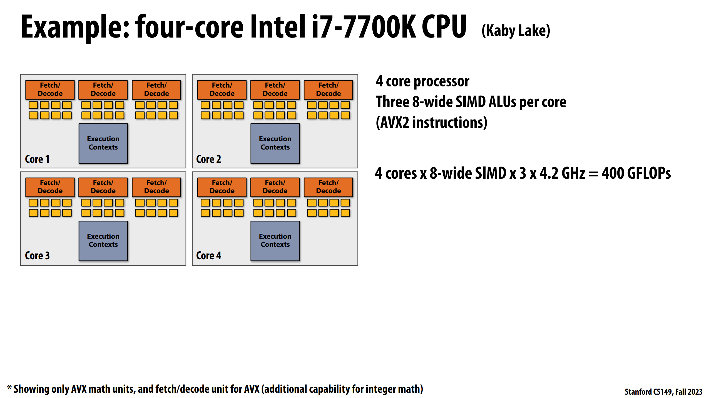

# Three forms of parallel execution

### __Superscalar__
Exploit ILP within an instruction stream. Process different instructions from the same
instruction stream in parallel (within a core)
- Parallelism automatically discovered by the hardware during execution

### __SIMD__

Multiple ALUs controlled by same instruction (within a core)
- Efficient for data-parallel workloads: amortize control costs over many ALUs
- Vectorization done by compiler (explicit SIMD) or at runtime by hardware (implicit SIMD)

### __Multi-core__

Use multiple processing cores to provide thread-level parallelism: simultaneously execute a completely different instruction stream on each core
- Software creates threads to expose parallelism to hardware (e.g., via threading API)

# Multi-Core Architecture

Consider a multi-core processor that runs at 2 GHz and has 4 cores. Each core can perform up to one
8-wide SIMD vector instruction per clock and supports hardware multi-threading with 4 hardware
execution context per core. 
> What is the maximum throughput of the processor in units of scalar floating point operations per second?
>> Processor max throughput = 4 cores * 8-wide SIMD * 2 GHz = 64 GFLOPS

Consider the above processor running a program that perfectly parallelizes onto many cores, makes perfect usage of SIMD vector processing, and has an arithmetic intensity of 4. (4 scalar floating ops per byte of data transferred from memory.) 

If we assume the processor has a memory system providing 64 GB/sec of bandwidth, is the program compute-bound or bandwidth bound on this processor? Assume that 1 GB/sec is a one billion bytes per second
> With arithmetic intensity of 4, to have max processor throughput of 64 GFLOPS the system requires 16 GB data transferred from memory each second. 
> Here the processor has a memory system providing 64 GB/sec of bandwidth so the program is compute-bound

